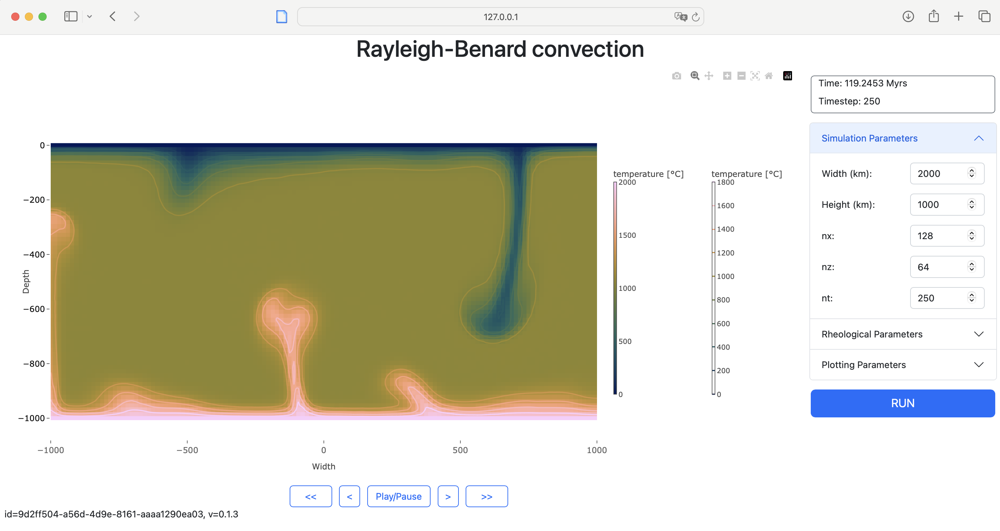

# Interactive geodynamics examples

The goal of these exercises is to give you a first feeling for some key geological processes. We will use the [InteractiveGeodynamics](https://github.com/JuliaGeodynamics/InteractiveGeodynamics.jl) for this, which provides a graphical user interface that runs in a web browser

### Installation
You can install the package with
```julia
julia>]
pkg> add InteractiveGeodynamics
```
and use it with:
```julia
julia> using InteractiveGeodynamics
```


### 1. Subduction dynamics
We start with looking at the dynamics of subducting plates with a GUI that simulates the subduction of a single slab. We use a linear viscosity of the slab and mantle.  
```julia
julia> using InteractiveGeodynamics
julia> folding()
```


#### Exercises
  1.1) Run the default simulation, which takes the free surface into account. What is the plate velocity at the end? And what are the maximum stresses that occur (`j2_dev_stress`)?
  
  1.2) Decrease the mantle viscosity by a factor 10. What happens with the plate velocity and maximum stress?
  
  1.3) What happens if you increase the viscosity of the crust and mantle by an order of magnitude? 
  
  1.4) Look at the passive pattern on the slab. What happens if the viscosity of the slab is the same as the one of the mantle?

Sofar we have looked at cases with a free surface. Yet, many convection (and some lithosphere dynamics codes), use a free slip upper boundary. Lets analyze what is different with a free slip boundary condition.
  
  1.5) Do the simulation with default parameters, but with free slip upper boundary. How does it change the slab dynamics and the stresses?
  
  1.6) Do simulations with a different viscosity contrast between slab and mantle. How does the slab bending radius depend on that?


### 2. Viscous folding
Next, we consider folding of viscous layers:
```julia
julia> using InteractiveGeodynamics
julia> folding()
```


#### Exercises
  2.1) Perform the default setup. What is the wavelength $\lambda$ of the folds? Note that you may have to increase the width of the model box to have sufficient folds. 

  2.2) Increase the viscosity contrast by a factor 10. How does this change $\lambda$?
  
  2.3) Change the fold thickness. What does this do to the wavelength?
  
  2.4) Change the amplitude of random noise to zero and look at the stress magnitude. How does the stress change if you increase the background strainrate? 
  
  2.5) Can you come up with an equation between stress $\tau_{II}$, viscosity $\eta_{\textrm{fold}}$ and background strainrate $\dot{\varepsilon}_{bg}$?

  2.6) [Bonus] Can you come up with an approximate equation that relates the wavelength of a single fold, $\lambda$, with its thickness ($H$), the viscosity of the fold ($\eta_{\textrm{fold}}$) and the viscosity of the matrix ($\eta_{\textrm{mat}}$)?

Lets consider a case with 2 or more layers. If they are far apart and thin, they should behave independently. Yet if they are close together, we would expect them to interact with each other. So lets test this.

  2.7) Consider a case with 2 layers that are spaced far apart. What is the fold wavelength and how does this compare to a setup with a single layer?

  2.8) Next, lets put them much closer together. What changes?

  2.9) Finally, lets create a stack of fold of 10 or more layers with thin weak layers inbetween, which effectively gives you an anisotropic layered setup. You will likely, have to increase the resolution to resolve the weak layers (increase `nz`). Note that inb LaMEM it is best if you use numbers that are a power of 2 (32,64,128,256 etc.). Also not that usually you need at least 2-3 elements over a layer to resolve it; if you plot the viscosity field you will see whether it is resolved or not. What changes?


### 3. Convection dynamics
In our final example we will look at convection on different scales.

```julia
julia> using InteractiveGeodynamics
julia> convection()
```



#### Exercises
  3.1) Perform the default setup, which simulates convection on an upper-mantle scale, with a slightly temperature-dependent viscosity (as indicated by the parameter $\gamma$).  What happens if you let it run with time? How much is the maximum viscosity contrast between the coldest and hottest part of the model?

  3.2) Do the same simulation with the same parameters but on the scale of a magma chamber (10 km wide by 5 km, which is a big mush chamber). Does it still convect with the default parameters?

  3.3) Play around with the viscosity prefactor $\eta_0$. When does it start convecting again?
  
  3.4) On Earth mantle rocks are strongly T-dependent (much more than what we simulate with the default simulation that has $\gamma=0.001$). Do the same simulation but with $\gamma=0.01$, which results in a viscosity contrast of around $10^6$. What happens with the lithosphere? Have a look at the horizontal velocity at the top of the lithosphere. Does it move?

  3.5) What are the stresses you obtain in this last simulation? On Earth, lithospheric plates clearly move, so there must be a mechanism to 'break' the lithosphere. In the simulation this is parameterised with a yield stress (a maximum stresses that can be reached in the rocks, set to 500 MPa by default). Use a lower value to 'break' the plate. What changes with the dynamics of the system?  
