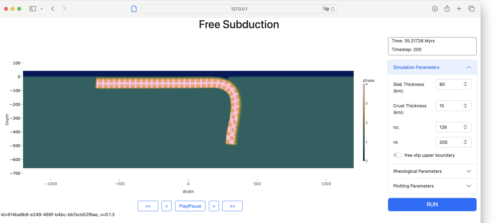

# Interactive geodynamics examples

The goal of these exercises is to give you a first feeling for some key geological processes. We will use the [InteractiveGeodynamics](https://github.com/JuliaGeodynamics/InteractiveGeodynamics.jl) for this, which provides a graphical user interface that runs in a web browser

### Installation
You can install the package with
```julia
julia>]
pkg> add InteractiveGeodynamics
```
and use it with:
```julia
julia> using InteractiveGeodynamics
```


### 1. Subduction dynamics
We start with looking at the dynamics of subducting plates with a GUI that simulates the subduction of a single slab. We use a linear viscosity of the slab and mantle.  


#### Exercises
1. Run the default simulation, which takes the free surface into account. What is the plate velocity at the end? And what are the maximum stresses that occur (`j2_dev_stress`)?
2. Decrease the mantle viscosity by a factor 10. What happens with the plate velocity and maximum stress?
3. What happens if you increase the viscosity of the crust and mantle by an order of magnitude? 
4. Look at the passive pattern on the slab. What happens if the viscosity of the slab is the same as the one of the mantle?

Sofar we have looked at cases with a free surface. Yet, many convection (and some lithosphere dynamics codes), use a free slip upper boundary. Lets analyze what is different with a free slip boundary condition.
1. Do the simulation with default parameters, but with free slip upper boundary. How does it change the slab dynamics and the stresses?
2. Do simulations with a different viscosity contrast between slab and mantle. How does the slab bending radius depend on that?
  
